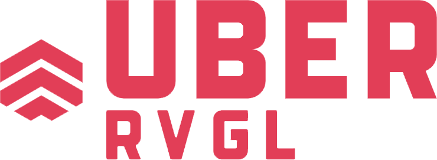
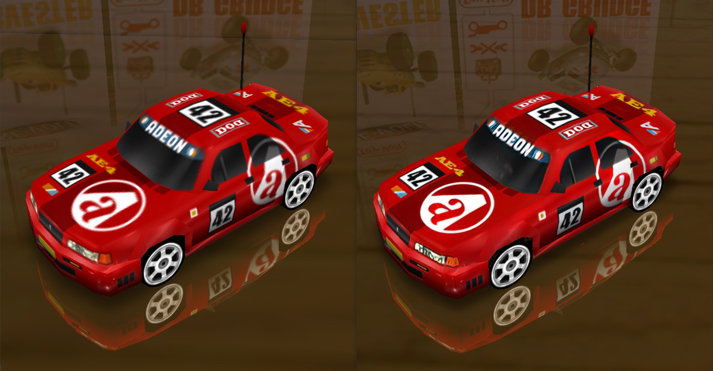
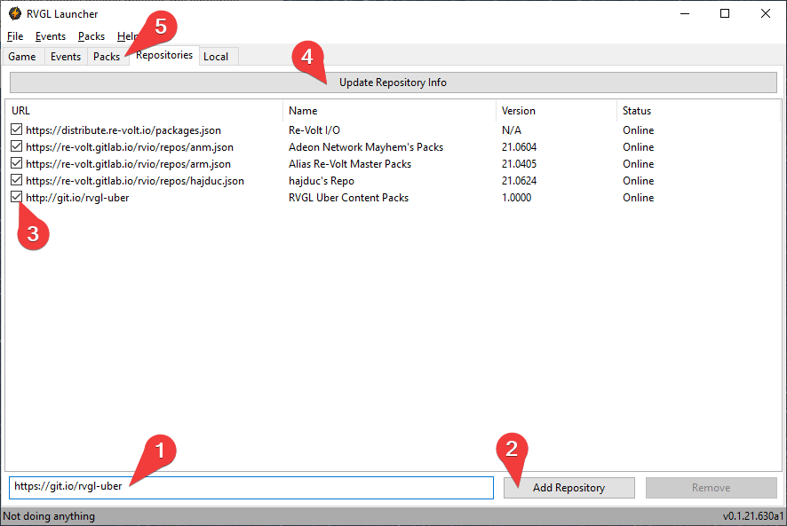

<p align="center">
    
    <p align="center">
        Various packs for <a href="https://gitlab.com/re-volt/rvgl-launcher">RVGL Launcher</a>
    </p>
</p>

## Contents

### AI-upscaled textures

Artificial Intelligence (AI)-upscaled textures provide a new high definition look for all game assets, including the standard io community packs.

There are two upscaling models:

- `line` - much sharper than original, but with more graphical glitches
- `standard` - less improvement from original, but also less graphical glitches

There are also two quality levels:

- `HD` - 512x512
- `UHD` - 1024x1024

Before/After (line, UHD):



## Installation

0. Open the [RVGL Launcher](https://gitlab.com/re-volt/rvgl-launcher)
1. At the bottom of your `Repositories` tab, type in the repo address:
   ```
   http://git.io/rvgl-uber
   ```
2. Click on `Add Repository`
3. Enable the new repository by marking the checkbox at the beginning of its row
4. Click on `Update Repository Info`
5. Go to the `Packs` tab. All new content will be availabe there, prefixed with `uber`. Select the packs you want, click `Install Packages`, and enjoy them in the game!

Graphical guide:

</img>

## Development

All development tools can be found under the [dev/](dev/) directory. A typical development flow will look like the following:

1. ### Prepare the assets

   `python3 build.py pre "C:\Users\<USER>\AppData\Local\rvmm\packs" "standard"`

   This will generate a bunch of new directories like `uber-standard-game_files`. For convenience, move them all into a new directory called `uber-standard`.

2. ### Upscaling the assets

   Run your upscaling program on the images within `uber-standard`. Note that the new images must be output next to the original files, suffixed with `-upscaled`.

3. ### Post-processing the assets

   `build.py post "uber-standard"`

   This will generate the final packs at each quality level, like `uber-standard-hd-game_files`.
